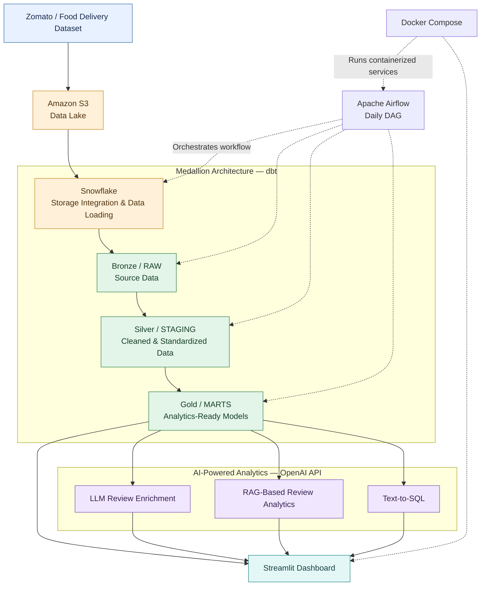

# AI-Powered Food Delivery Analytics Platform

## Overview

An end-to-end data engineering and AI analytics platform that processes Zomato food delivery data using Amazon S3, Snowflake, dbt, and Apache Airflow. The project implements a Medallion Architecture to transform raw data into analytics-ready datasets and integrates OpenAI-powered review enrichment, RAG-based review analytics, and text-to-SQL. Interactive dashboards and AI features are delivered through Streamlit, with the pipeline containerized using Docker Compose.

## Architecture



## Data Flow

```text
Zomato / Food Delivery Dataset
              ↓
         Amazon S3
          (Data Lake)
              ↓
          Snowflake
       (Data Warehouse)
              ↓
        dbt Transformations
              ↓
      Bronze → Silver → Gold
              ↓
       Analytics-Ready Data
              ↓
       ┌──────┼────────┐
       ↓      ↓        ↓
  LLM Review  RAG   Text-to-SQL
  Enrichment  Chat     Queries
       └──────┼────────┘
              ↓
        Streamlit App

Apache Airflow → Orchestrates the daily pipeline
Docker Compose → Runs the configured containerized services
```

## Technologies Used

* **Amazon S3** — Cloud storage and data lake.
* **Snowflake** — Cloud data warehouse for storing and querying datasets.
* **dbt** — SQL-based data transformations and medallion-layer modeling.
* **Apache Airflow** — Scheduling and orchestration of the daily data pipeline.
* **Docker Compose** — Containerization and management of the configured services.
* **OpenAI API** — LLM-powered review enrichment and natural-language AI capabilities.
* **Streamlit** — Interactive dashboards and AI-powered application interface.
* **Python and SQL** — Data processing, application logic, and analytical queries.

## Project Workflow

### 1. Data Ingestion

Food delivery data is stored in Amazon S3 and loaded into Snowflake using the configured data-loading process and storage integration.

### 2. Bronze Layer — RAW

The raw source data is retained in the warehouse to provide a foundation for downstream processing.

### 3. Silver Layer — STAGING

dbt transforms raw data into cleaned and standardized staging models. Transformations may include column standardization, data type handling, and preparation for analytical use.

### 4. Gold Layer — MARTS

dbt creates analytics-ready models, including fact tables, dimension tables, and aggregate models where implemented. These datasets support reporting and AI-powered analytics.

### 5. Workflow Orchestration — Apache Airflow

A daily Airflow DAG coordinates the configured pipeline tasks, manages task dependencies, and supports scheduled data processing.

### 6. Containerization — Docker Compose

Docker Compose is used to run and manage the services defined in the project's container configuration, supporting a consistent development environment.

### 7. AI-Powered Review Enrichment

The OpenAI API processes customer review text to generate structured information, such as sentiment or other review insights, according to the implemented prompts and output schema.

### 8. RAG-Based Review Analytics

The retrieval-augmented generation (RAG) feature retrieves relevant review information and uses it as context to answer questions about customer feedback.

### 9. Text-to-SQL

The text-to-SQL feature translates natural-language questions into SQL for querying the analytical data. Generated queries should be validated and restricted to permitted read-only operations.

### 10. Streamlit Dashboard

Streamlit provides an interactive interface for exploring analytical datasets and accessing the implemented AI features.

## Key Features

* End-to-end ELT pipeline using Amazon S3 and Snowflake.
* Snowflake storage integration for data loading.
* Medallion Architecture using dbt.
* Daily workflow orchestration using Apache Airflow.
* Containerized data pipeline environment using Docker Compose.
* OpenAI-powered LLM review enrichment.
* RAG-based customer review analytics.
* Natural-language-to-SQL querying.
* Interactive Streamlit application.

## Project Links

* **Live Streamlit Application:** https://zomato-ai-analytics.streamlit.app/

## Project Outcome

The project combines modern data engineering practices with AI-powered analytics to transform food delivery data into structured, analytics-ready information. It demonstrates how cloud storage, a data warehouse, SQL transformations, workflow orchestration, and LLM-based applications can work together in a single platform.
